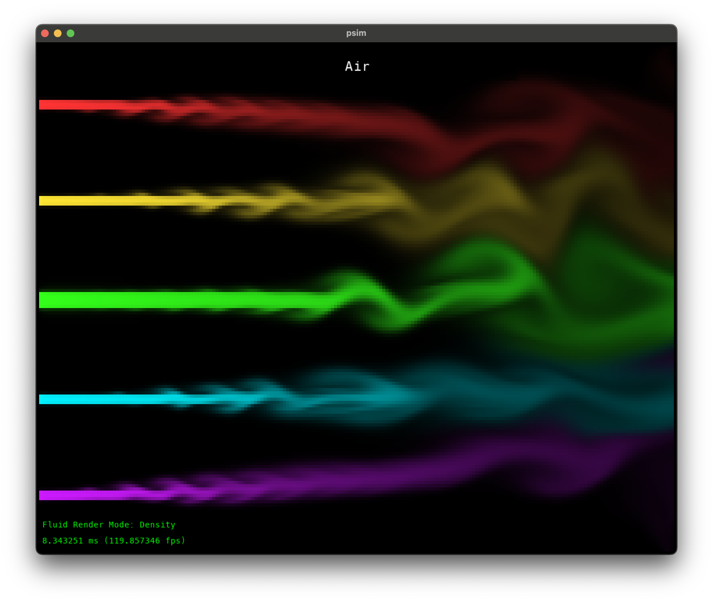
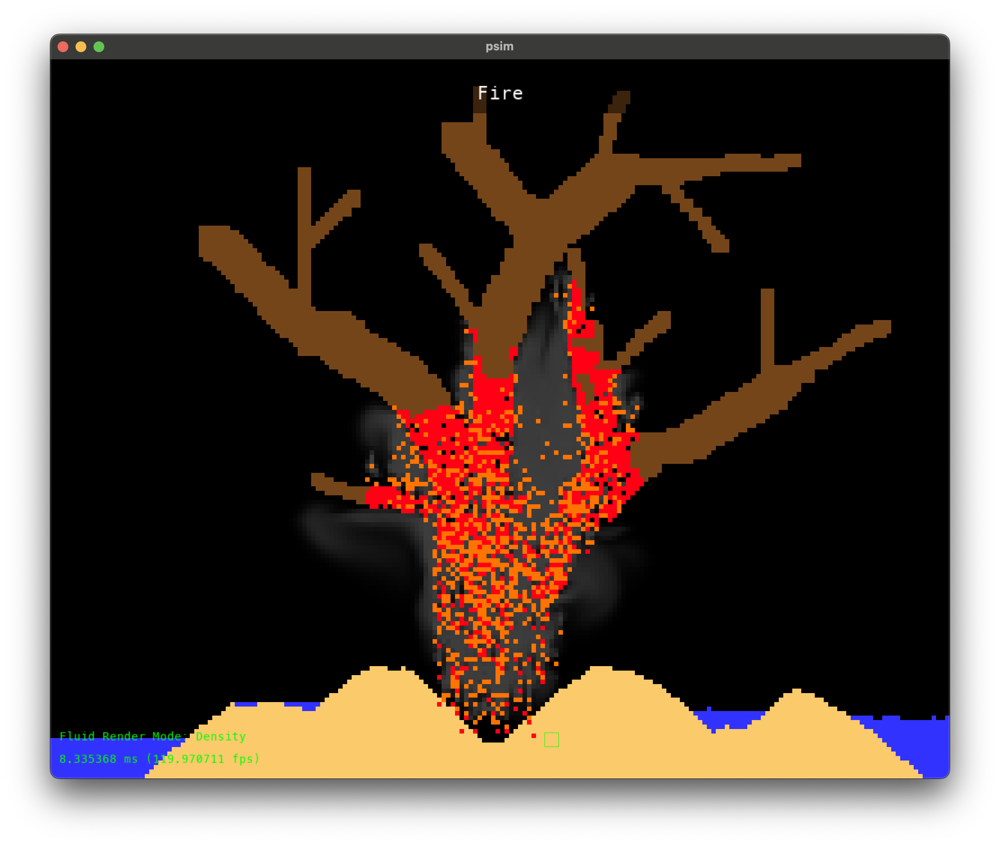

#PSIM (*P*article *Sim*ulator)
PSIM is a fluid and particle simulator sandbox designed inspired by [*Powder Game*](https://dan-ball.jp/en/javagame/dust/). Particles are simulated as simple cellular automota on the CPU, and fluid is simulated on the GPU. Fluid responds to changes in the particle simulation.

## Controls
[1] - Sand
[2] - Wall
[3] - Water
[4] - Wood
[5] - Fire
[0] - Air

[Up / Down] - Cycle fluid render mode
[Spacebar] - Pause/resume simulation
[- / =] - Decrease/increase cursor size
[C] - Clear screen
[S] - Toggle side fluid streams

